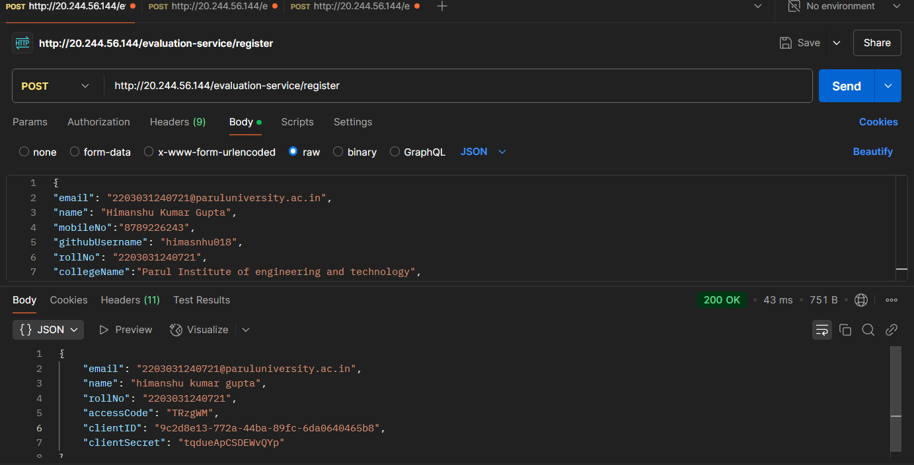
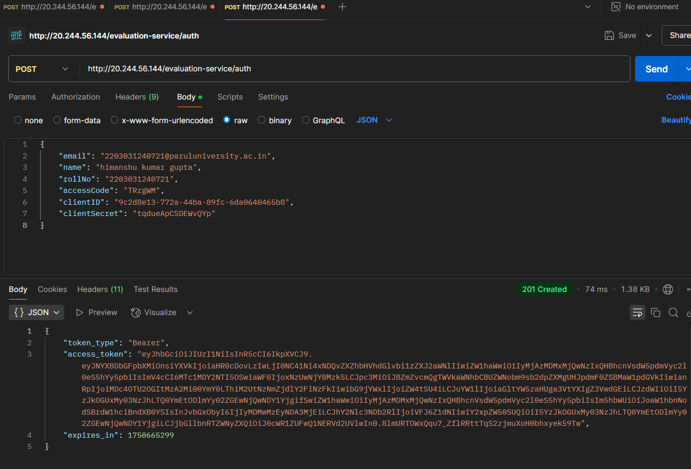
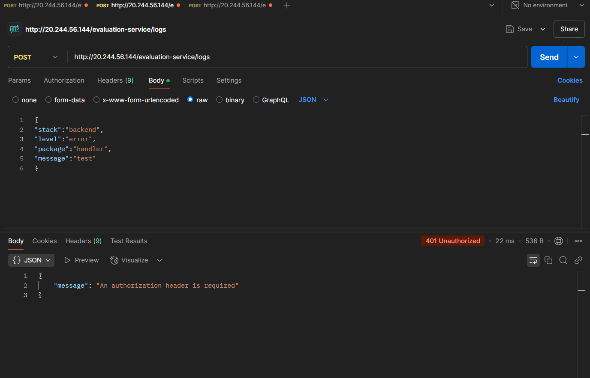
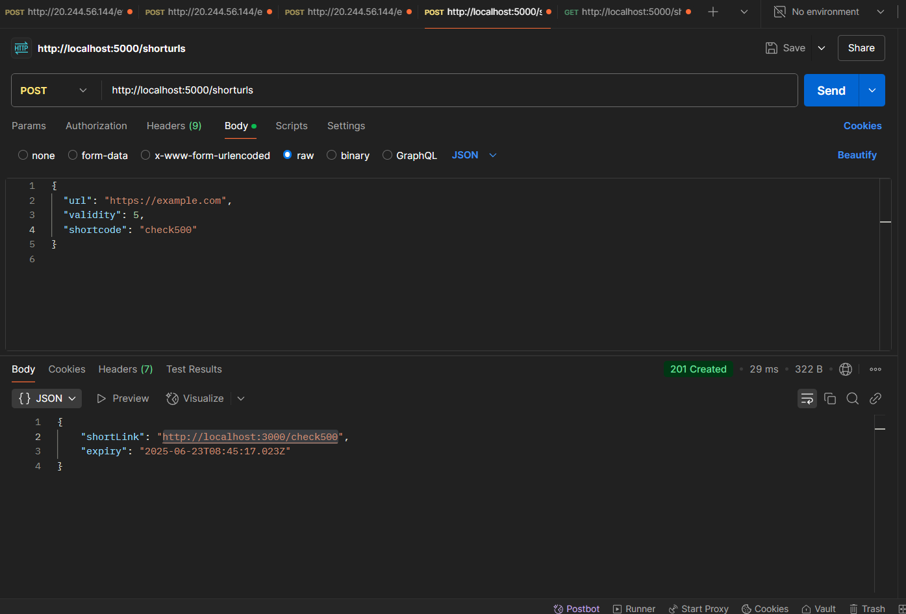
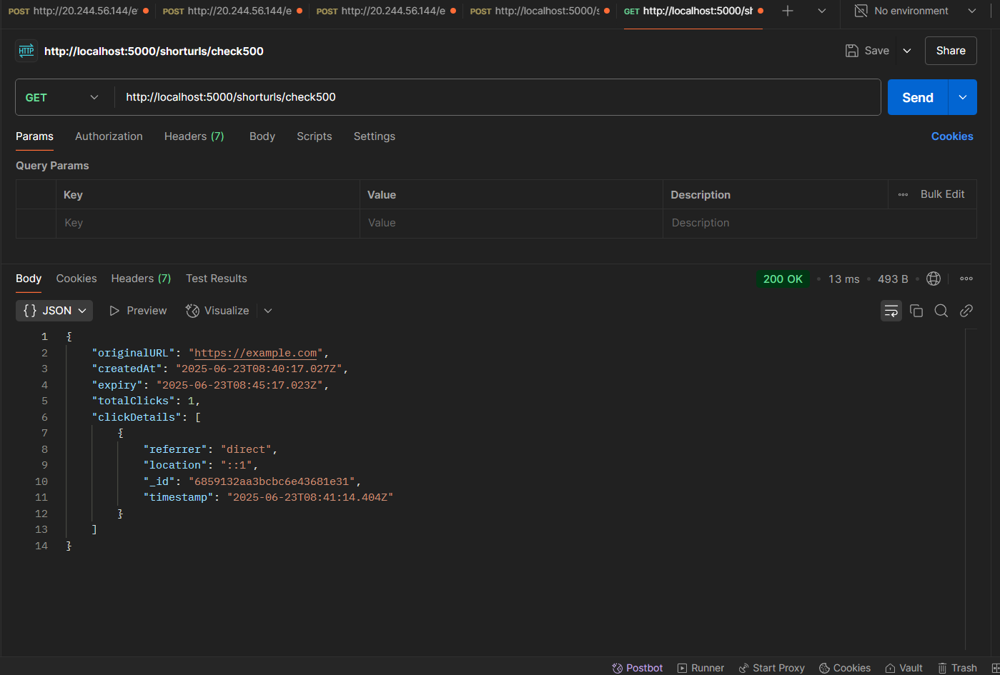

# 🔗 URL Shortener Microservice

A robust HTTP URL Shortener Microservice built with **Node.js**, **Express.js**, **MongoDB**, and a reusable **Logging Middleware**.
---

## 🧩 Features

- ✅ Shorten long URLs
- ✅ Optional custom shortcodes
- ✅ Automatic expiry (default: 30 minutes)
- ✅ Redirect support
- ✅ MongoDB persistence
- ✅ Reusable logging middleware
- ❌ No login required

---


## 🛠️ Setup

### 1. Clone & Install

```bash
git clone git@github.com:himasnhu018/2203031240721.git
cd Backend Test Submission
npm install

mongoose.connect("mongodb://127.0.0.1:27017/urlshortener")

headers: {
  "Content-Type": "application/json",
  "Authorization": "Bearer YOUR_ACCESS_TOKEN"
}

Run the Server
node server.js

POST /shorturls

{
  "url": "https://example.com",
  "validity": 15,
  "shortcode": "mycustom"
}

{
  "shortLink": "http://localhost:5000/mycustom",
  "expiry": "2025-06-23T15:30:00Z"
}

GET /:shortcode

GET http://localhost:5000/mycustom

GET /shorturls/:shortcode


Response: 
{
  "originalURL": "https://example.com",
  "createdAt": "2025-06-23T14:00:00.000Z",
  "expiry": "2025-06-23T14:30:00.000Z",
  "totalClicks": 2,
  "clickDetails": [
    {
      "timestamp": "2025-06-23T14:15:00.000Z",
      "referrer": "direct",
      "location": "::1"
    }
  ]
}


Author
Himanshu Kumar Gupta
Roll No: 2203031240721
Email: 2203031240721@paruluniversity.ac.in


### 🔐 1. Registration Success



### 🆔 2. Client ID & Secret Received



### 🛠️ 3. Logging Middleware (Handler Example)



### ✂️ 4. Shorten a Long URL



### 🔁 5. Get Stats for a Short URL


